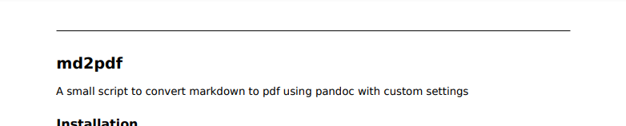

# md2pdf
A small script to convert markdown to pdf using pandoc with custom settings

## Dependencies
### Arch based Distributions
```bash
sudo pacman -S pandoc ttf-dejavu texlive-core
```

### Debian based Distributions
```bash
sudo apt install pandoc fonts-dejavu texlive-xetex
```

### Other
You can probably figure it out yourself, based on the two commands above

## Manual Installation
1. Download the [md2pdf](https://raw.githubusercontent.com/RubixDev/md2pdf/main/md2pdf.sh) file:\
   `wget https://raw.githubusercontent.com/RubixDev/md2pdf/main/md2pdf.sh`
2. Replace 'YOUR NAME HERE' at the top with your actual name. This will appear in the header of the exported PDFs:\
   `sed -i 's/YOUR NAME HERE/<name>/g' md2pdf.sh`
3. Rename it to `md2pdf` without `.sh`:\
   `mv md2pdf.sh md2pdf`
4. Make the file executable:\
   `chmod +x md2pdf`
5. Move the file to `/usr/local/bin`\
   `sudo mv md2pdf /usr/local/bin/`

## Automatic Installation
Alternatively, you can also use the automatic install script, which asks for your name (which will appear in the header of the PDFs) and places the file in `/usr/local/bin`, which should be in your PATH.

### For fish users:
```bash
wget https://raw.githubusercontent.com/RubixDev/md2pdf/main/install.sh
bash install.sh
rm install.sh
```

### For the rest:
```bash
bash -c "$(curl -fsSL https://raw.githubusercontent.com/RubixDev/md2pdf/main/install.sh)"
```
or
```bash
bash -c "$(wget -O- https://raw.githubusercontent.com/RubixDev/md2pdf/main/install.sh)"
```

## Usage
```bash
md2pdf <input file> <output file> \
    -l|--left-head [header left text] \
    -c|--center-head [header center text] \
    -r|--right-head [header right text] \
    -n|--name-location [left|center|right] \
    --preserve-tex
```
- `-l`, `-c`, `-r` and their long counterparts control the text to appear in the head of each page
- `-n` or `--name-location` followed by one of `left`, `center` or `right` controls where to place the name in the head
  - By default it will be placed left
  - The name can be overwritten by the previously mentioned flags
  - If anything else is provided, the name will not be displayed
- The `--preserve-tex` option keeps the generated `.tex` file

### Examples

```bash
md2pdf README.md README.pdf
```


```bash
md2pdf README.md README.pdf -l " "
```



```bash
md2pdf README.md README.pdf -l 29.08.2021 -n right
```


```bash
md2pdf README.md README.pdf \
    --center-head "Text with spaces" \
    --right-head 29.08.2021 \
    --name-location left
```

